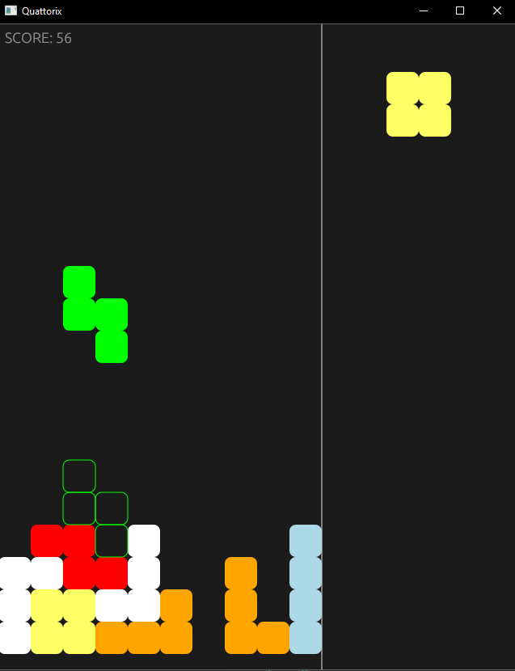

# Introduction

This is an implementation of some of the rules of the popular [Tetris](https://en.wikipedia.org/wiki/Tetris) game using [egui](https://github.com/emilk/egui) for the graphical interface, done for education purposes.



## Installation and how to run

If you have cargo, just run

```console
cargo install tetris-gui
```

and run

```
tetris-gui
```

in the command line.

## Commands

- Arrow keys control movement;
- Q/E controls counterclockwise and clockwise rotation respectively;
- Z hard drops;
- Space pauses;
- Escape exits.
